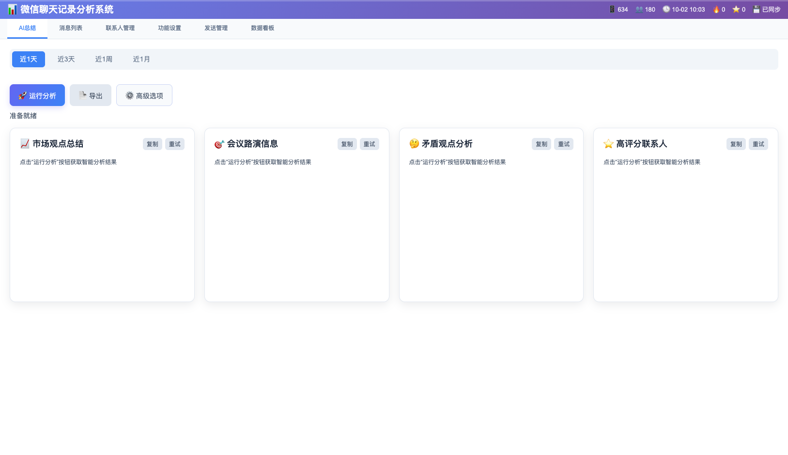
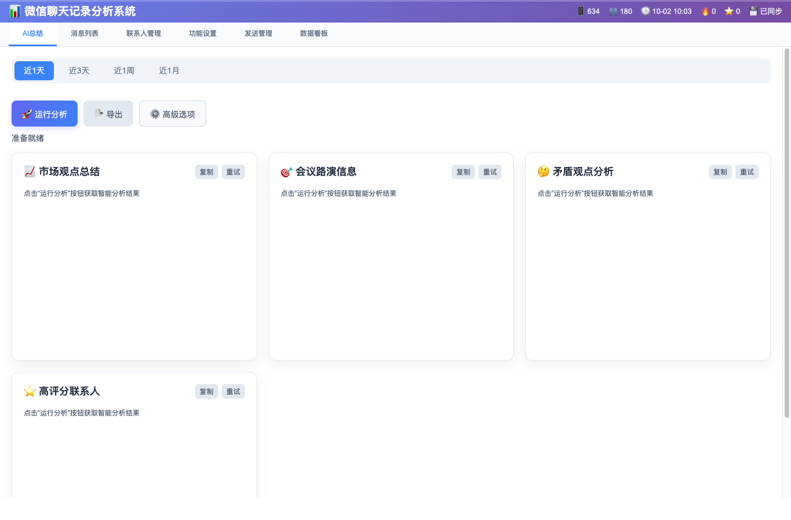
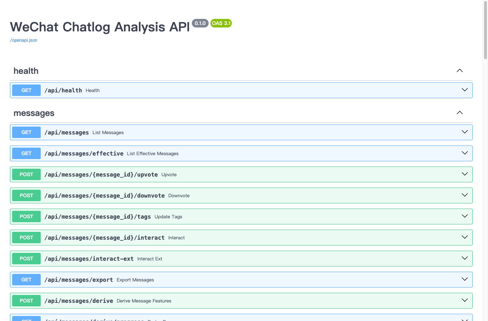
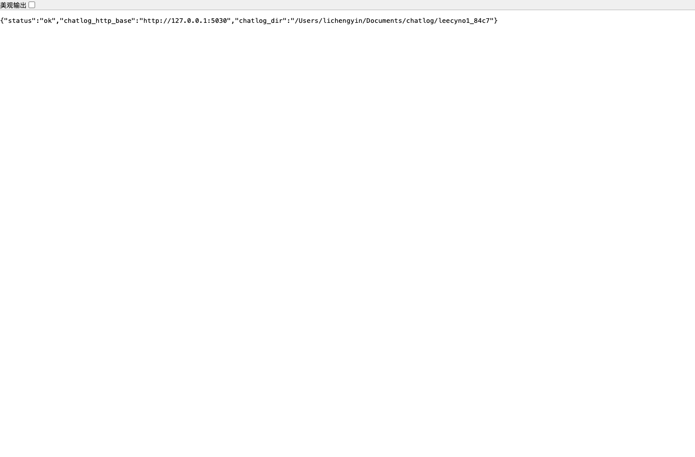
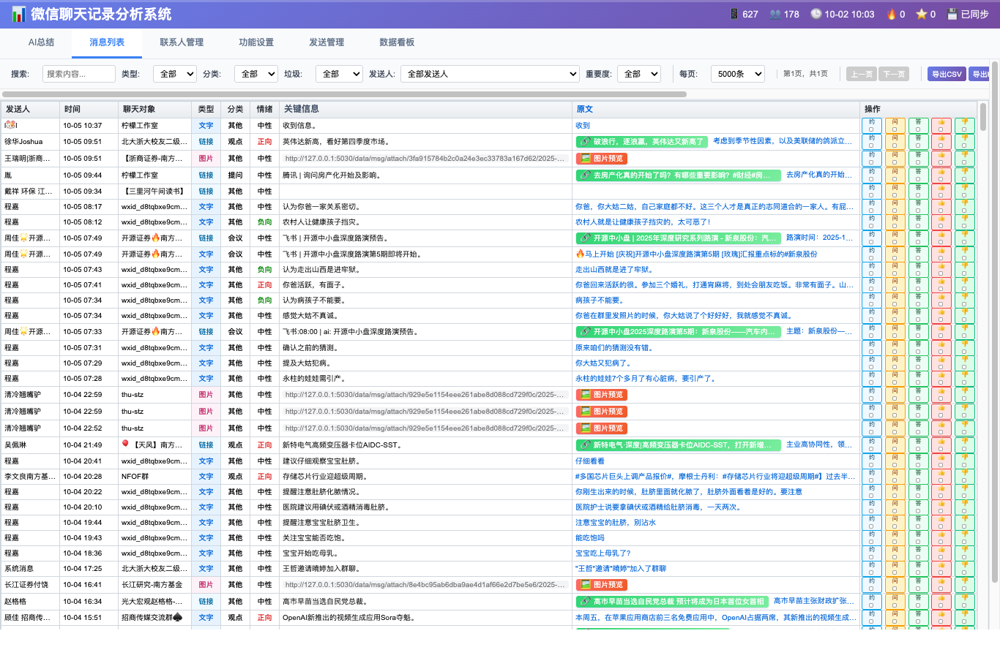
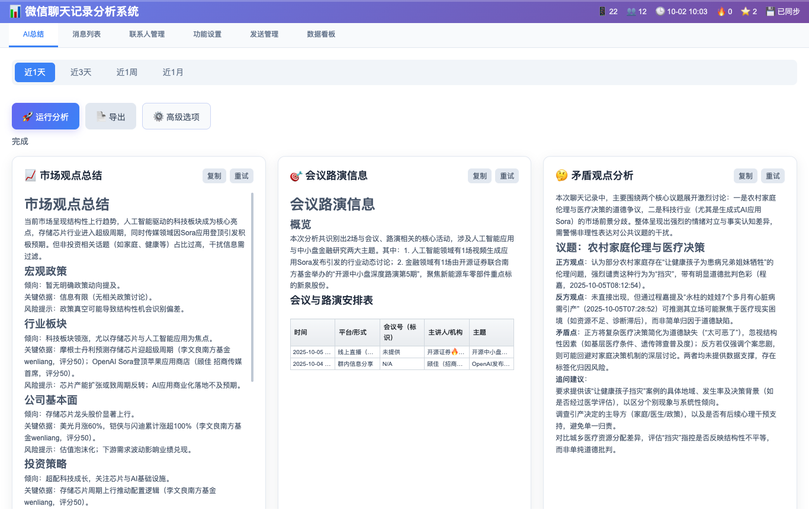

% 微信聊天记录分析系统（FastAPI + SQLite + n8n）

版本：**v0.8.0**（见 `VERSION` / `docs/RELEASE_NOTES_v0.8.0.md`）

一个面向“聊天记录检索 + AI 总结 + 自动发送”的最小可用后端：
- FastAPI + SQLite(FTS5) 提供高效存储与全文检索
- 支持从 chatlog HTTP 服务增量拉取、离线导入目录（可选）
- 本地 SiliconFlow 接口完成总结与候选回复生成；发送可选对接 n8n/WeChatPadPro
- 自带极简 UI（`/static/index.html`）便于验收与演示

v0.8.0 重点能力（面向验收）
- AI 总结：增量摘要缓存（刷新可恢复）+ payload 瘦身降 Token
- 会议信息：3 列紧凑表格（时间｜平台/会议号｜主题要点），主题仅取摘要 summary 并自动换行
- 新闻舆情：来源徽标/气泡可点击查看引用来源（消息/新闻），支持按 id 回查
- 联系人：评分可编辑保存；消息行“顶/踩”可加减分；评分 < 40 自动拉黑（持久化）
- 黑白名单：支持联系人 + 群聊（talkers）管理；黑名单对象强制不进入微信/邮件列表

预览界面

更多截图

目录导航
- 快速开始
- 主要特性
- 目录结构
- 配置说明
- 常用 API
- 开发与调试
- 安全与发布建议

快速开始
1) 初始化环境变量
   cp .env.example .env

2) 安装并启动（推荐脚本）
   bash scripts/manage.sh install
   bash scripts/manage.sh start

   常用：
   - 状态：bash scripts/manage.sh status
   - 日志：bash scripts/manage.sh logs -f
   - 停止：bash scripts/manage.sh stop
   - 同步：bash scripts/manage.sh sync

3) 手动方式（可选）
   python3 -m venv .venv
   source .venv/bin/activate
   pip install -r requirements.txt
   uvicorn app.main:app --host 127.0.0.1 --port 8000

4) 验证与访问
   - 前端最小页：http://127.0.0.1:8000/
   - 健康检查：curl http://127.0.0.1:8000/api/health
   - 搜索示例：curl 'http://127.0.0.1:8000/api/messages?q=hello'

主要特性
- 全文检索：基于 SQLite FTS5 的消息/联系人检索
- AI 总结：本地接口生成摘要、争议分析、候选回复等
- 同步能力：支持 chatlog HTTP 增量/全量拉取
- 发送通道：集成 WeChatPadPro（HTTP+WS），可扩展 n8n
- 极简 UI：检索、过滤、总结与群发一体化验收页
- 邮件引擎：多账户 IMAP 收取 + SMTP 发送，UI 与微信消息对齐
- 新闻聚合：对接 @newsnow，内嵌其原生页面
- 自媒体聚合：对接 @folo，以同样的列表风格融合展示
- 扩展消息：按 langbot 适配器配置生成动态标签页（Telegram/QQ/企微/飞书等）
- （可选）macOS 提醒事项：会议路演“📅 预约”可写入 Reminders（仅 macOS）

目录结构
app/            FastAPI 应用/路由/服务/模型/配置/模式
data/           运行期数据库与 AI 产物（默认 data/app.db，已忽略）
scripts/        管理脚本入口 scripts/manage.sh
static/         最小 UI；站点根与 /static/*
docs/ n8n/      参考文档与示例工作流

配置说明（.env）
- CHATLOG_HTTP_BASE：chatlog HTTP 服务地址
- CHATLOG_DIR：本地聊天目录，用于离线导入（可留空）
- N8N_REPLY_WEBHOOK / N8N_SUMMARY_WEBHOOK / N8N_CONTACT_WEBHOOK / N8N_SEND_WEBHOOK / N8N_AUTH_TOKEN
- DATABASE_URL：默认 sqlite:///./data/app.db

常用 API（节选）
- GET /api/health
- GET /api/messages?q=关键词
- POST /api/messages/{id}/upvote|downvote
- POST /api/messages/{id}/tags
- GET /api/chats  GET /api/contacts
- POST /api/contacts/{id}/rating?delta=1
- POST /api/ai/suggest-replies  POST /api/ai/summary
- POST /api/send
- POST /api/sync/chatlog
- 邮件：GET/POST /api/email/accounts，POST /api/email/accounts/{id}/sync，GET /api/email/messages，POST /api/email/send
- 新闻：GET /api/news/config（前端 iframe 使用）；配置：GET/POST /api/config/newsnow
- 新闻回查：GET /api/newsfeed/by-ids?ids=...
- 自媒体：GET /api/folo/posts；配置：GET/POST /api/config/folo
- 黑/白名单：GET/POST /api/filters
- （可选）提醒事项：POST /api/tools/reminders/add
- 扩展消息：GET/POST /api/extensions/adapters，POST /api/extensions/adapters/{key}/ingest，GET /api/extensions/messages?adapter_key=xxx；配置：GET/POST /api/config/extensions

开发与调试
- 热重载：bash scripts/manage.sh dev 或 uvicorn app.main:app --reload
- 本地数据：python scripts/seed_sample_data.py
- 生成快照：python scripts/run_summary_snapshot.py --period 3days
- 运行测试：pytest -q 或 python test_summary_improvement.py

安全与发布建议
- 切勿提交 .env / data/（已在 .gitignore 中忽略）
- 默认 CORS 较宽松，用于本地调试；上线前在 app/main.py 收紧
- 备份 data/app.db；如迁移位置，设置 DATABASE_URL
- 若使用 n8n，请使用 Bearer Token 并妥善保管

关于许可
本项目采用 Apache-2.0 许可证，详见 LICENSE。

致谢
本项目基于 FastAPI/Starlette/SQLite 等优秀组件构建，感谢开源社区。
